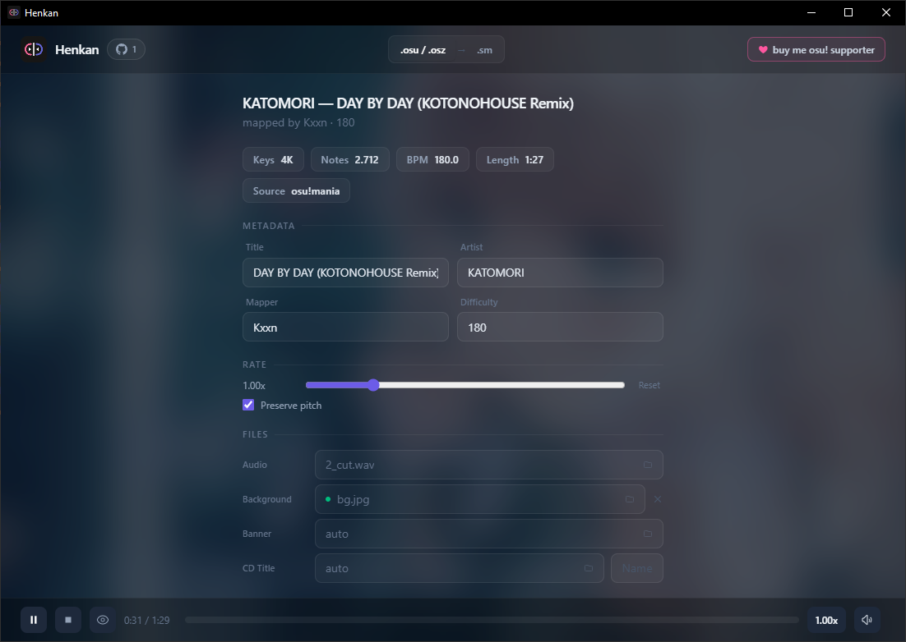
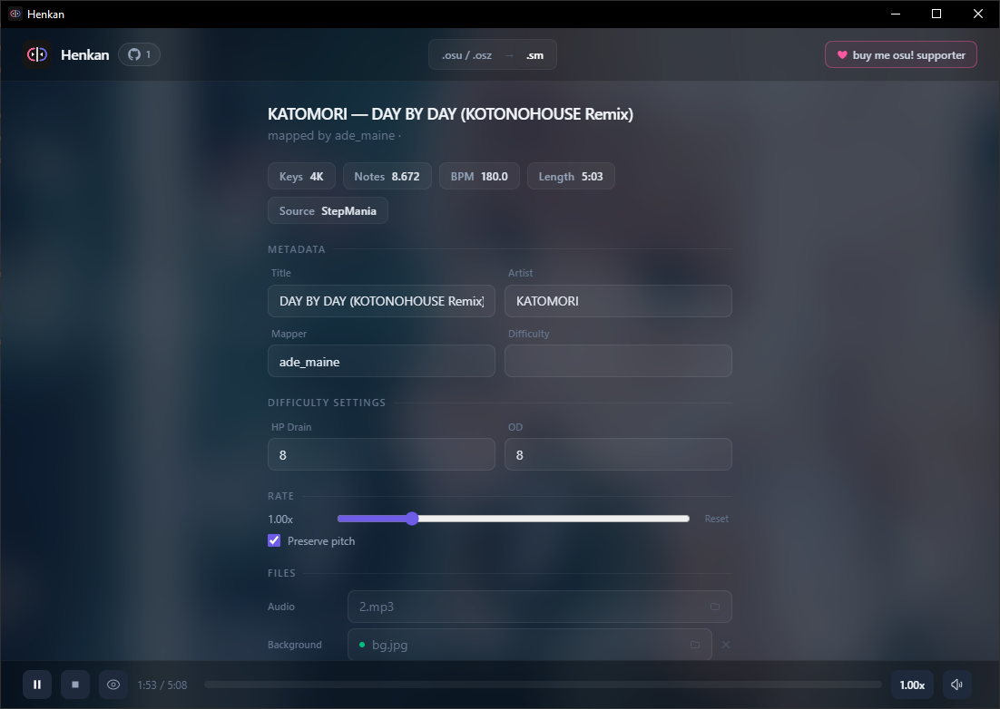

# Henkan 変換

**osu!mania ↔ Etterna / StepMania beatmap converter.**

The reliable VSRG converter you asked for.

## Introduction

> There are a handful of converters out there, but most of them mess up the timing - notes drift, BPM changes get flattened, and holds break. Henkan does it properly: millisecond-accurate timing, full note conversion, BPM changes preserved, holds intact. What comes out is exactly what went in.

Drag a .osu, .osz, or .sm file onto the window and it just works. Cross-platform, native performance, no web wrapper.

## Features

- **osu!mania (.osu / .osz) ↔ Etterna (.sm)** - timing, holds, BPM changes, metadata
- **Metadata mapping** - title, artist, creator, difficulty, preview point
- **BPM changes** - multiple tempo changes supported
- **Hold/Long notes** - start/end translation
- **Background references** - preserved across formats

> Note: SV (scroll velocity) is not converted in the osu → .sm direction —
> the .sm format has no equivalent of osu's green lines.

## Screenshots

### Main Interface


### Pack Conversion


### Etterna Conversion



### Osu! Conversion



### Preview


## Install

### macOS

**Desktop app** (Apple Silicon):

```bash
brew tap kaanreal/tap
brew install --cask kaanreal/tap/henkan
```

**CLI only** (builds from source, requires Rust):

```bash
brew tap kaanreal/tap
brew install kaanreal/tap/henkan-cli
```

---

### Windows

**Winget:**

```powershell
winget install kaanreal.henkan
```

**Chocolatey:**

```powershell
choco install henkan
```

---

### Linux

**Arch (AUR):**

```bash
yay -S henkan
```

**AppImage / .deb:** download from [Releases](https://github.com/kaanreal/henkan/releases).

---

### Direct download

Pre-built binaries for all platforms are on the [Releases](https://github.com/kaanreal/henkan/releases) page.

| Platform | Format |
|----------|--------|
| Windows | `.msi` |
| macOS (Apple Silicon) | `.dmg` |
| Linux | `.AppImage`, `.deb` |

---

Built with [Tauri](https://tauri.app) + [React](https://react.dev) + [Rust](https://rust-lang.org).
