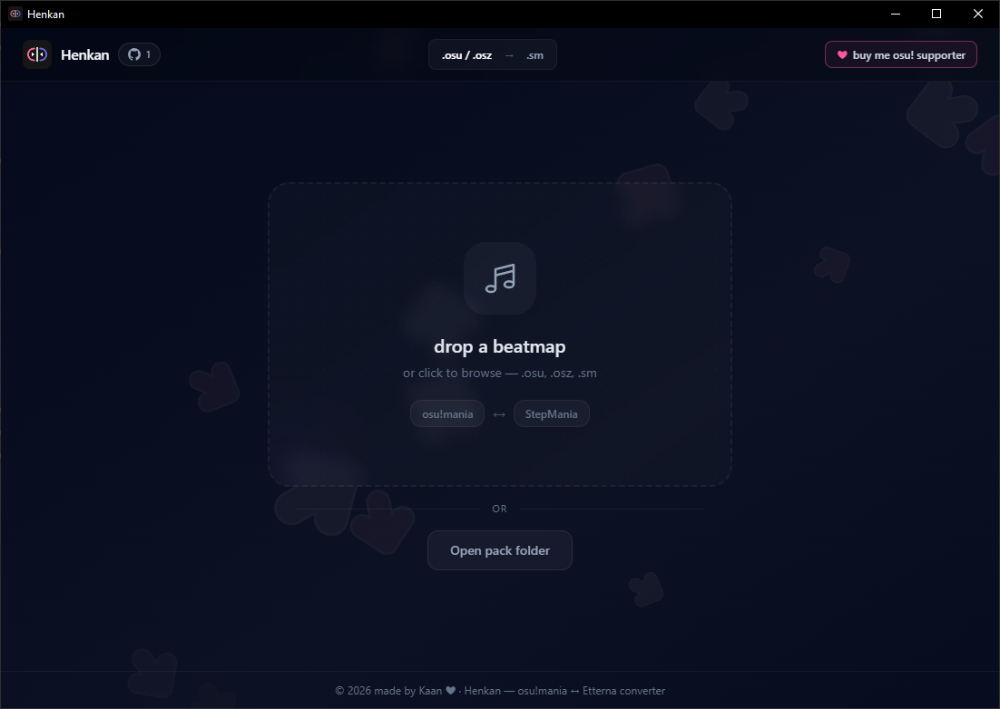
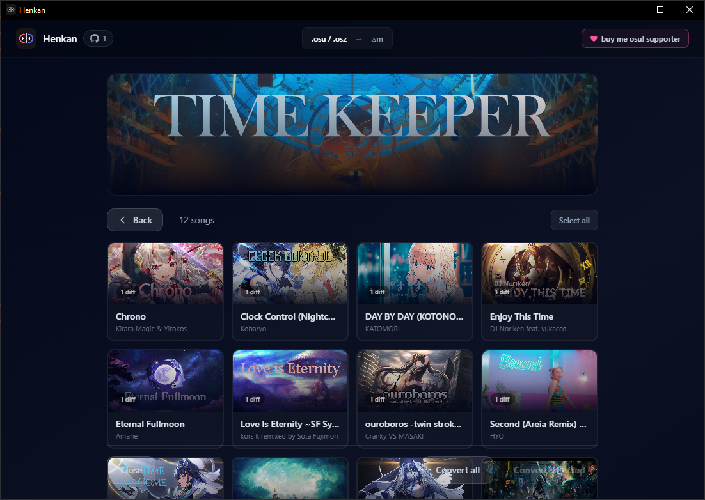
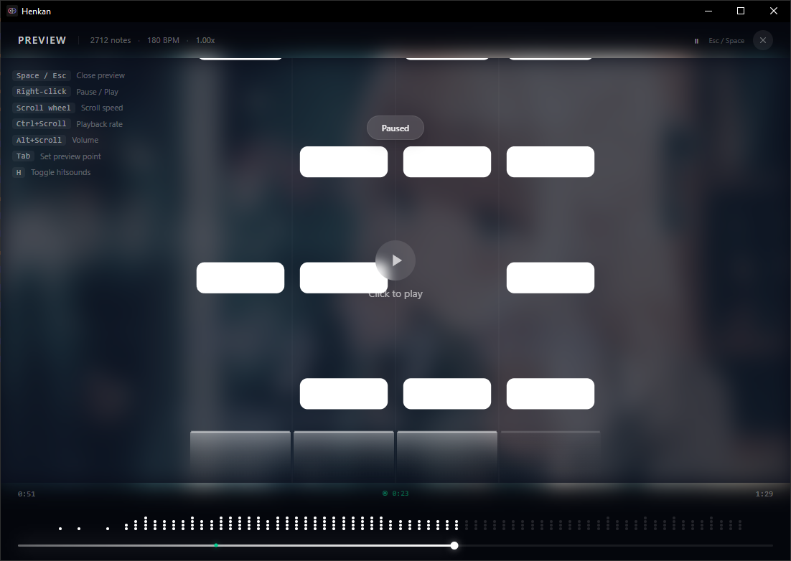

# Henkan 変換

> Name idea by Kesrie.

> A careful osu!mania ↔ Etterna / StepMania converter.

Henkan keeps the maps details intact: millisecond timing, BPM changes, long
notes, metadata, and snapping, just drop in an `.osu`, `.osz`, or `.sm`.

## What it does

- Converts osu!mania (`.osu` / `.osz`) and Etterna/StepMania (`.sm`) maps both ways
- Converts 4K osu!mania gameplay skins (`.osk`, `.zip`, or folders) and Etterna dance noteskins both ways
- Preserves timing points, holds, chart metadata, preview points, and snapping
- Handles individual maps and pack folders
- Runs as a native Tauri desktop app, CLI, and browser-capable converter

## Get Henkan

| Platform   | Install                                                                                     |
| ---------- | ------------------------------------------------------------------------------------------- |
| macOS      | `brew install --cask kaanreal/tap/henkan`                                                   |
| macOS CLI  | `brew install kaanreal/tap/henkan-cli`                                                      |
| Windows    | `winget install kaanreal.henkan` or `choco install henkan`                                  |
| Arch Linux | `yay -S henkan`                                                                             |
| Linux      | Download an AppImage or `.deb` from [Releases](https://github.com/kaanreal/henkan/releases) |

## A quick tour

| Pack conversion                                            | Map preview                                    |
| ---------------------------------------------------------- | ---------------------------------------------- |
|  |  |

## Built with care

Tauri + React + Rust + WebAssembly.

If Henkan helped your maps find a new home, a star on GitHub is always lovely.
